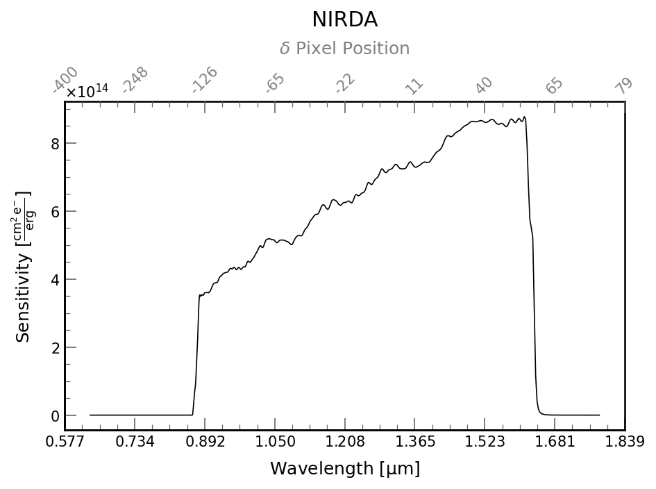

# Documentation for `NIRDetector`

The `NIRDetector` class shows you what to expect from the Near IR side of Pandora. The key information on the detector is given below.



## API Documentation for `pandorasat.NIRDetector`

::: pandorasat.irdetector.NIRDetector
    selection:
      docstring_style: numpy
