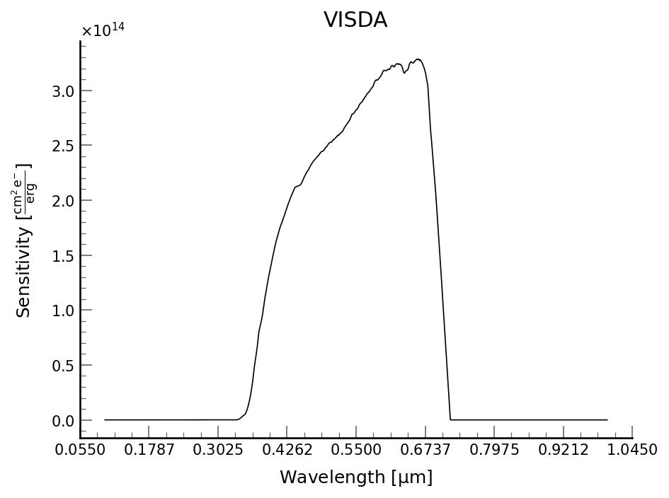

# Documentation for `VISDA`

The `VisibleDetector` class shows you what to expect from the Visible side of Pandora. The key information on the detector is given below.



## API Documentation for `pandorasat.VisibleDetector`

::: pandorasat.visibledetector.VisibleDetector
    selection:
      docstring_style: numpy
      exclude-members:
        - "^_.*"  # Exclude all members that start with an underscore
    rendering:
      show_root_heading: false
      show_source: false
